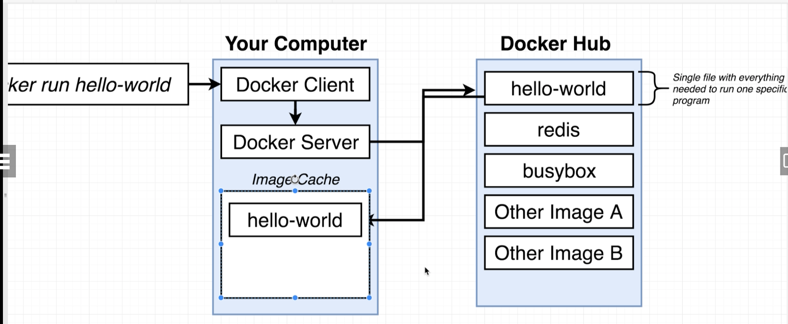
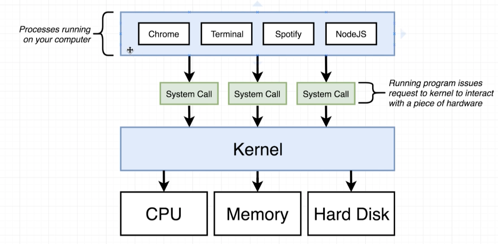
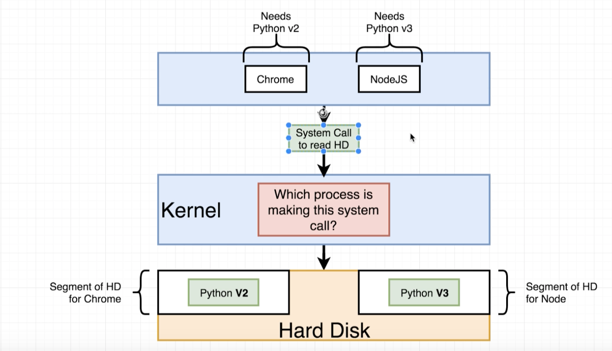
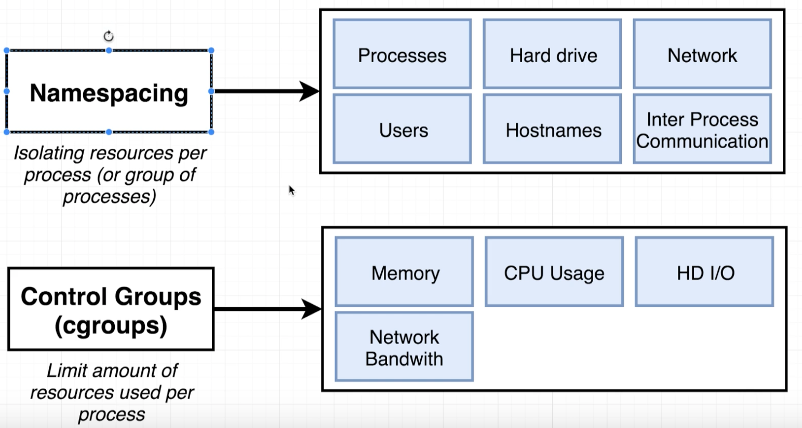
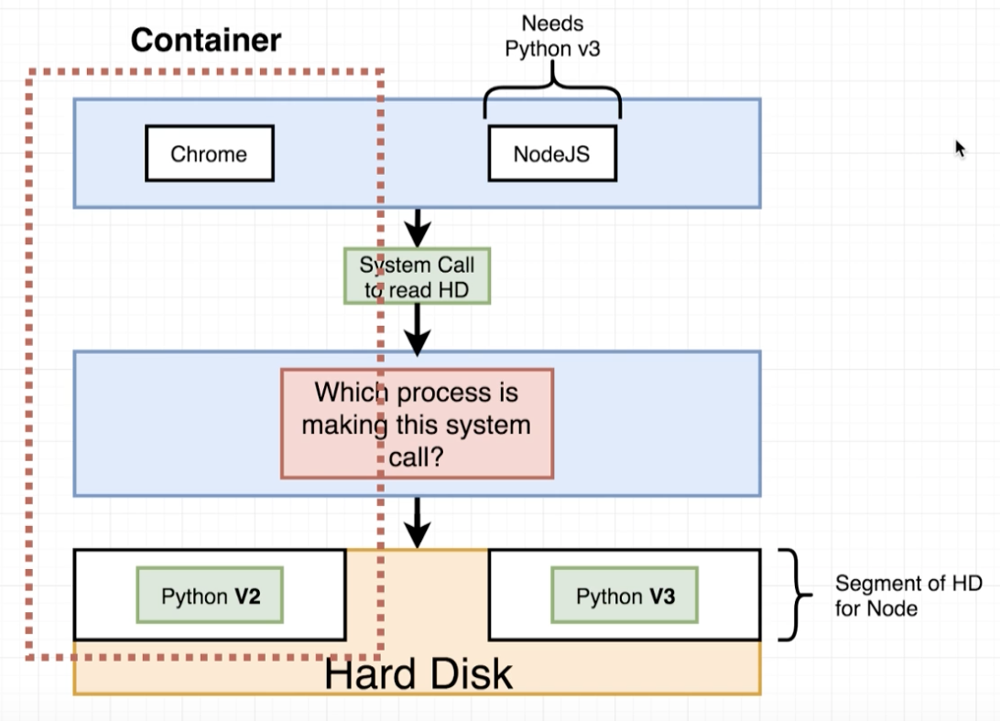
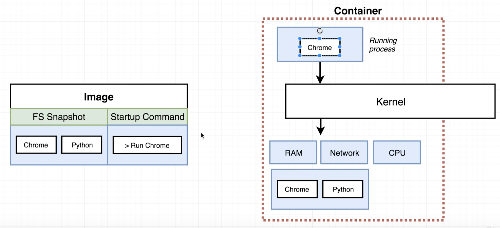
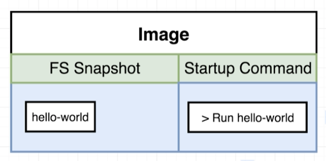
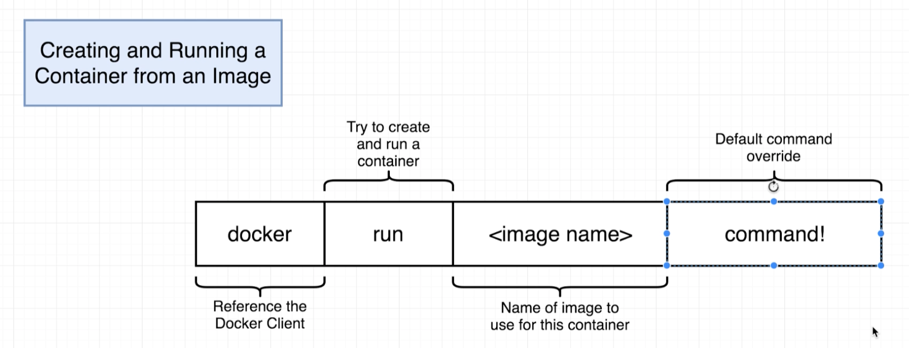
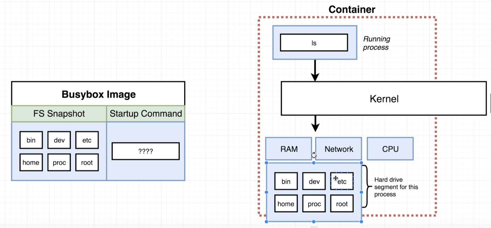
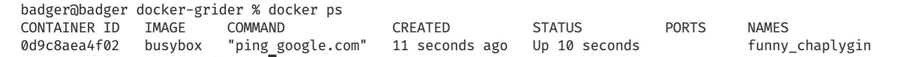

## Installing docker on MacOS

docker.com

get started button => developer tab => download for mac (click)

`docker version` - check version

## Using docker client

`docker run hello-world`

- docker looks at local cache,
- if there is no image, it grabs it from hub and puts it to local cache
- and creates a container out of that image
  

## But Really...What's a Container?

What is operating system

software interacts with hardware thour _kernel_

_Segments_

_Namespacing_

_Container_ - running process (chrome) along with subset of physical resources (hard drive, ...)

_Image_ - snapshot of file system along with specific startap command

## How's docker running on your computer?

_Namespaces_ and _Control groups_ are specific to _Linux_, not to _Windwows_ or _MacOS_

When we've installed docker, we've installed Linux vm
All containers will be created inside this vm

## Docker run in detail

`docker run <image name>` - creating and running a container from an image

## overriding_default_commands

`docker run busybox echo hi there`

`docker run busybox ls` - list folders in container

this _ls_ command has to exist inside _busybox_ fs snapshot. Otherwise we would see an error

## Listing running containers

`docker ps` - list running containers

for example, to get lasting container:
`docker run busybox ping google.com` - ping latency to google services

