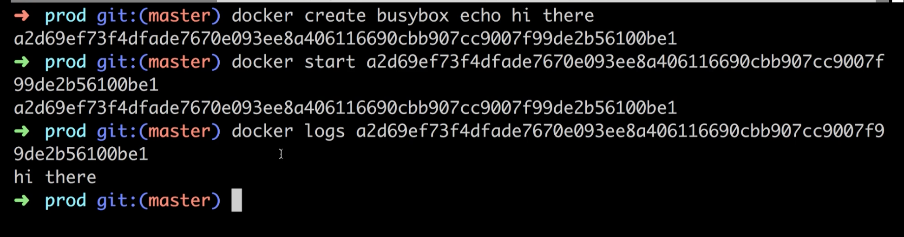

## Installing docker on MacOS

docker.com

get started button => developer tab => download for mac (click)

`docker version` - check version

## Using docker client

`docker run hello-world`

- docker looks at local cache,
- if there is no image, it grabs it from hub and puts it to local cache
- and creates a container out of that image
  

## But Really...What's a Container?

What is operating system

software interacts with hardware thour _kernel_

_Segments_

_Namespacing_

_Container_ - running process (chrome) along with subset of physical resources (hard drive, ...)

_Image_ - snapshot of file system along with specific startap command

## How's docker running on your computer?

_Namespaces_ and _Control groups_ are specific to _Linux_, not to _Windwows_ or _MacOS_

When we've installed docker, we've installed Linux vm
All containers will be created inside this vm

## Docker run in detail

`docker run <image name>` - creating and running a container from an image

## overriding_default_commands

`docker run busybox echo hi there`

`docker run busybox ls` - list folders in container

this _ls_ command has to exist inside _busybox_ fs snapshot. Otherwise we would see an error

## Listing running containers

`docker ps` - list running containers

for example, to get lasting container:
`docker run busybox ping google.com` - ping latency to google services

`docker container ls`, `docker stop <container id>` - stop container

---

`docker ps --all` - list all containes ever have been created

## Container lifecycle

`docker run <image name>` - creating and running a container from an image

`docker run` = `docker create` + `docker start`

---

`docker create hello-world` - we'll get _id_ of created container
`docker start -a <id>` - start container
`-a` - watch the output from container and print to terminal

## Restarting stopped containers

`docker start -a <id> echo bye there` - if default command is `echo hi there`, we can't replace it with another command - we'll get an error `you cannot start and attach multiple containers at once`

## Removing stopped container

`docker ps --all` - see stopped containers (they take space on computer)

`docker system prune` - remove:

- all stopped containers
- all networks not used by at least one container
- all dangling images
- all build cache

_all build cache_ - images will be fetched out form docker hub
We'll have to download it back to hub if we'll run it

`docker ps --all` - list containers

## Retrieving log outputs

`docker logs <container id>` - get logs from a container

## Stopping containers

`docker create busybox ping google.com`
// <id>
`docker start <id>`
// <id>
`docker logs <id>`
// logs
`docker ps`
// list containers

there 2 options to stop container

`docker stop <container id>` - stop primary running process with _SIGTERM_ command and do a cleanup (save smth, etc)
If container doesn't stops in 10 seconds, it will fall back to `docker kill <container_id>`

`docker kill <container id>` - kill running process immidiately (_SIGKILL_ is sent to process)
Use if containers doesn't respond to `docker stop <container id>`

## Multi-command containers

`docker run redis` - run redis server

## Executing Commands in Running Containers

`docker exec -it <container_id> <command>` - execute an additional command in a container

`docker exec -it 3766a42c0b28 redis-cli` - set second running program in a container
127.0.0.1:6379> set myValue 5
OK
127.0.0.1:6379> get myValue
"5"
127.0.0.1:6379>
`-it` - to add text to container

## The Purpose of the `it` Flag

every process in linux environment has 3 communication channels

- STDIN
- STDOUT
- STDERR

`-it` = `-i -t`
`-i` - attach input in terminal to STDIN channel of the process
`-t` - nicely format text on screen

## Getting a Command Prompt in a Container

`docker exec -it sh` - open shell in context of running container

steps:
`docker ps`
`docker exec -it <container_id> sh`

---

examples of commands:
`cd ~/`
`ls`
`echo hi there`
`redis-cli` (ctrl+d to stop)

## Starting with a shell

`docker run -it busybox sh` - start a new container from busybox image and start shell and attach input

if we want additional commands to be executable:
`docker exec -it <container_id> <command>`

## Container isolation

containers don't share file system space
(touch hi-there - create file)

## Creating docker images

## Building a dockerfile
