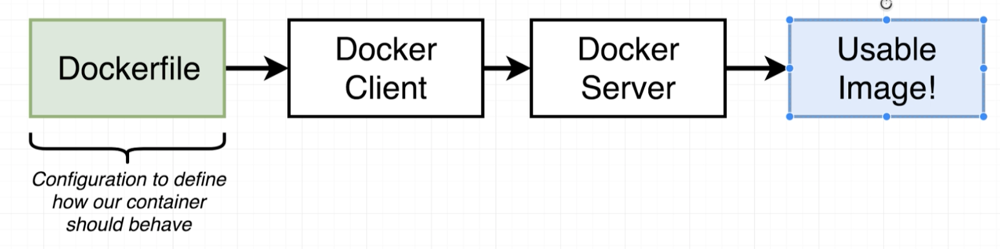

# Dive into docker

## Installing docker on MacOS

docker.com

get started button => developer tab => download for mac (click)

`docker version` - check version

## Using docker client

`docker run hello-world`

- docker looks at local cache,
- if there is no image, it grabs it from hub and puts it to local cache
- and creates a container out of that image
  

## But Really...What's a Container?

What is operating system


software interacts with hardware thour _kernel_

_Segments_


_Namespacing_


_Container_ - running process (chrome) along with subset of physical resources (hard drive, ...)


_Image_ - snapshot of file system along with specific startap command


## How's docker running on your computer?

_Namespaces_ and _Control groups_ are specific to _Linux_, not to _Windwows_ or _MacOS_

When we've installed docker, we've installed Linux vm
All containers will be created inside this vm

# Manipulating containers with the docker client

## Docker run in detail

`docker run <image name>` - creating and running a container from an image

## overriding default commands

`docker run busybox echo hi there`


`docker run busybox ls` - list folders in container


this _ls_ command has to exist inside _busybox_ fs snapshot. Otherwise we would see an error

## Listing running containers

`docker ps` - list running containers

for example, to get lasting container:
`docker run busybox ping google.com` - ping latency to google services


`docker container ls`, `docker stop <container id>` - stop container

---

`docker ps --all` - list all containes ever have been created

## Container lifecycle

`docker run <image name>` - creating and running a container from an image

`docker run` = `docker create` + `docker start`

---

`docker create hello-world` - we'll get _id_ of created container
`docker start -a <id>` - start container
`-a` - watch the output from container and print to terminal

## Restarting stopped containers

`docker start -a <id> echo bye there` - if default command is `echo hi there`, we can't replace it with another command - we'll get an error `you cannot start and attach multiple containers at once`

## Removing stopped container

`docker ps --all` - see stopped containers (they take space on computer)

`docker system prune` - remove:

- all stopped containers
- all networks not used by at least one container
- all dangling images
- all build cache

_all build cache_ - images will be fetched out form docker hub
We'll have to download it back to hub if we'll run it

`docker ps --all` - list containers

## Retrieving log outputs

`docker logs <container id>` - get logs from a container


## Stopping containers

`docker create busybox ping google.com`
// <id>
`docker start <id>`
// <id>
`docker logs <id>`
// logs
`docker ps`
// list containers

there 2 options to stop container

`docker stop <container id>` - stop primary running process with _SIGTERM_ command and do a cleanup (save smth, etc)
If container doesn't stops in 10 seconds, it will fall back to `docker kill <container_id>`

`docker kill <container id>` - kill running process immidiately (_SIGKILL_ is sent to process)
Use if containers doesn't respond to `docker stop <container id>`

## Multi-command containers

`docker run redis` - run redis server

## Executing Commands in Running Containers

`docker exec -it <container_id> <command>` - execute an additional command in a container


`docker exec -it 3766a42c0b28 redis-cli` - set second running program in a container
127.0.0.1:6379> set myValue 5
OK
127.0.0.1:6379> get myValue
"5"
127.0.0.1:6379>
`-it` - to add text to container

## The Purpose of the `it` Flag


every process in linux environment has 3 communication channels

- STDIN
- STDOUT
- STDERR

`-it` = `-i -t`
`-i` - attach input in terminal to STDIN channel of the process
`-t` - nicely format text on screen

## Getting a Command Prompt in a Container

`docker exec -it sh` - open shell in context of running container

steps:
`docker ps`
`docker exec -it <container_id> sh`

---

examples of commands:
`cd ~/`
`ls`
`echo hi there`
`redis-cli` (ctrl+d to stop)

## Starting with a shell

`docker run -it busybox sh` - start a new container from busybox image and start shell and attach input

if we want additional commands to be executable:
`docker exec -it <container_id> <command>`

## Container isolation

containers don't share file system space
(touch hi-there - create file)

# Building custom images throught docker server

## Creating docker images


## Building a dockerfile

redis-image / Dockerfile

```
# Use an existing docker image as a base
From alpine

# Download and install a dependency
RUN apk add --update redis

# Tell the image what todo whet it starts as a container
CMD ["redis-server"]
```

`docker build .`
take container id

`docker run <container_id>`

## Dockerfile teardown


`FROM` - image used as a base
`RUN` - command while preparing custom image
`CMD` - what to execute when image is used to instanstiate a new container

## What's a base image


`FROM alpine` - _apline_ includes set of programms usefull for installing and installing programs

`RUN apk add --update redis` - download and install redis.
`apk` is not a docker command (apache package kit). It is a package manager preinstalled on _apline_

## The Build Process in Detail



`docker build .` - giving docker file to docker cli

_build_ - generate image from docker file

. - docker context

`FROM alpine` - first docker server looked at local build cache if it has downloaded _aplpine_ image. It didn't find local image, so it than reached to docker hub - public repository of images.

---

except for _FROM_ we have intermediate containers


With every additional instruction (RUN and CMD so far):

- we take the image that was generated during previous step and create a new container from it
- execute startup command or make a change in file system in that container
- than make a snapshot of that container and make in image that will be used by next step
- image from last step is the resultant image
  

## A brief recap


## Rebuilds with cache

In the previous file we'll add `RUN apk add --update gcc`

_Dockerfile_

```
# Use an existing docker image as a base
From alpine

# Download and install a dependency
RUN apk add --update redis
RUN apk add --update gcc

# Tell the image what todo whet it starts as a container
CMD ["redis-server"]
```

and run `docker build .`

note: we'll get `CACHED`:

```
 => [internal] load build definition from Dockerfile                                                                                 0.0s
 => => transferring dockerfile: 264B                                                                                                 0.0s
 => [internal] load .dockerignore                                                                                                    0.0s
 => => transferring context: 2B                                                                                                      0.0s
 => [internal] load metadata for docker.io/library/alpine:latest                                                                     1.6s
 => [auth] library/alpine:pull token for registry-1.docker.io                                                                        0.0s
 => [1/3] FROM docker.io/library/alpine@sha256:4edbd2beb5f78b1014028f4fbb99f3237d9561100b6881aabbf5acce2c4f9454                      0.0s
 => CACHED [2/3] RUN apk add --update redis                                                                                          0.0s
 => [3/3] RUN apk add --update gcc                                                                                                  11.7s
 => exporting to image                                                                                                               0.7s
 => => exporting layers                                                                                                              0.7s
 => => writing image sha256:4287e63e5cf88e5f26cbf1a81bfee84442b045606b0b5adde8a8106be368436d
```

this means that image after `step RUN apk add --update redis` was already built, so it can be used from cache

## Tagging an image

`docker build .`
get output
`writing image sha256:4287e63e5cf88e5f26cbf1a81bfee84442b045606b0b5adde8a8106be368436d `  
thant run
`docker run 4287e63e5cf`


convention to name tags:


create tagged container :
`docker build -t orenkole/redis:latest .`

now we can run container :
`docker run orenkole/redis`

## Manual Image Generation with Docker Commit

instead of file Dockerfile, we'll use console:
`docker run -it alpine sh`
`# apk add --update redis`

open second terminal and take running container, assign default command and create an image:

```
docker ps
docker commit -c 'CMD ["redis-server"]' a38362d3aaee
// sha256:739e7e63e67fdad7ed21fe35147e93f05592f96ca3388ef4f701dceca7da6b95
docker run 739e7e63e67
// 1:M 17 Apr 2022 16:14:09.914 * Ready to accept connections
```

`-c` - specify default command

# Making real project with docker

## Project outline


Disclaimer: We're going to do a few things slightly wrong!

## Node server setup
