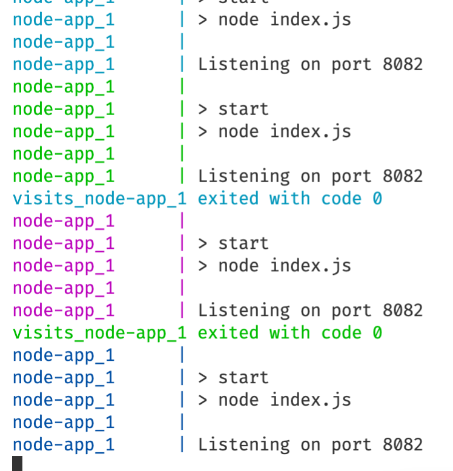
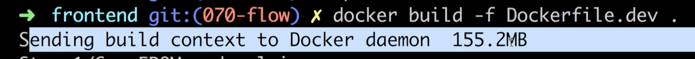
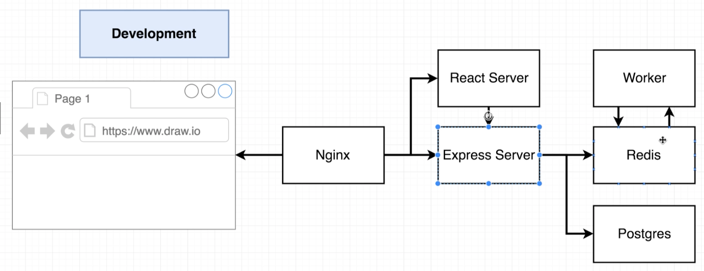
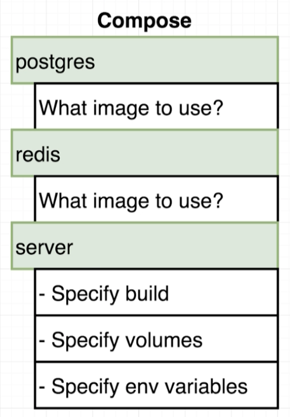

https://github.com/StephenGrider/DockerCasts

# Dive into docker

## Installing docker on MacOS

docker.com

get started button => developer tab => download for mac (click)

`docker version` - check version

## Using docker client

`docker run hello-world`

- docker looks at local cache,
- if there is no image, it grabs it from hub and puts it to local cache
- and creates a container out of that image
  

## But Really...What's a Container?

What is operating system


software interacts with hardware thour _kernel_

_Segments_


_Namespacing_


_Container_ - running process (chrome) along with subset of physical resources (hard drive, ...)


_Image_ - snapshot of file system along with specific startap command


## How's docker running on your computer?

_Namespaces_ and _Control groups_ are specific to _Linux_, not to _Windwows_ or _MacOS_

When we've installed docker, we've installed Linux vm
All containers will be created inside this vm

# Manipulating containers with the docker client

## Docker run in detail

`docker run <image name>` - creating and running a container from an image

## overriding default commands

`docker run busybox echo hi there`


`docker run busybox ls` - list folders in container


this _ls_ command has to exist inside _busybox_ fs snapshot. Otherwise we would see an error

## Listing running containers

`docker ps` - list running containers

for example, to get lasting container:
`docker run busybox ping google.com` - ping latency to google services


`docker container ls`, `docker stop <container id>` - stop container

---

`docker ps --all` - list all containes ever have been created

## Container lifecycle

`docker run <image name>` - creating and running a container from an image

`docker run` = `docker create` + `docker start`

---

`docker create hello-world` - we'll get _id_ of created container
`docker start -a <id>` - start container
`-a` - watch the output from container and print to terminal

## Restarting stopped containers

`docker start -a <id> echo bye there` - if default command is `echo hi there`, we can't replace it with another command - we'll get an error `you cannot start and attach multiple containers at once`

## Removing stopped container

`docker ps --all` - see stopped containers (they take space on computer)

`docker system prune` - remove:

- all stopped containers
- all networks not used by at least one container
- all dangling images
- all build cache

_all build cache_ - images will be fetched out form docker hub
We'll have to download it back to hub if we'll run it

`docker ps --all` - list containers

## Retrieving log outputs

`docker logs <container id>` - get logs from a container


## Stopping containers

`docker create busybox ping google.com`
// <id>
`docker start <id>`
// <id>
`docker logs <id>`
// logs
`docker ps`
// list containers

there 2 options to stop container

`docker stop <container id>` - stop primary running process with _SIGTERM_ command and do a cleanup (save smth, etc)
If container doesn't stops in 10 seconds, it will fall back to `docker kill <container_id>`

`docker kill <container id>` - kill running process immidiately (_SIGKILL_ is sent to process)
Use if containers doesn't respond to `docker stop <container id>`

## Multi-command containers

`docker run redis` - run redis server

## Executing Commands in Running Containers

`docker exec -it <container_id> <command>` - execute an additional command in a container


`docker exec -it 3766a42c0b28 redis-cli` - set second running program in a container
127.0.0.1:6379> set myValue 5
OK
127.0.0.1:6379> get myValue
"5"
127.0.0.1:6379>
`-it` - to add text to container

## The Purpose of the `it` Flag


every process in linux environment has 3 communication channels

- STDIN
- STDOUT
- STDERR

`-it` = `-i -t`
`-i` - attach input in terminal to STDIN channel of the process
`-t` - nicely format text on screen

## Getting a Command Prompt in a Container

`docker exec -it sh` - open shell in context of running container

steps:
`docker ps`
`docker exec -it <container_id> sh`

---

examples of commands:
`cd ~/`
`ls`
`echo hi there`
`redis-cli` (ctrl+d to stop)

## Starting with a shell

`docker run -it busybox sh` - start a new container from busybox image and start shell and attach input

if we want additional commands to be executable:
`docker exec -it <container_id> <command>`

## Container isolation

containers don't share file system space
(touch hi-there - create file)

# Building custom images throught docker server

## Creating docker images


## Building a dockerfile

redis-image / Dockerfile

```docker
# Use an existing docker image as a base
FROM alpine

# Download and install a dependency
RUN apk add --update redis

# Tell the image what todo whet it starts as a container
CMD ["redis-server"]
```

`docker build .`
take container id

`docker run <container_id>`

## Dockerfile teardown


`FROM` - image used as a base
`RUN` - command while preparing custom image
`CMD` - what to execute when image is used to instanstiate a new container

## What's a base image


`FROM alpine` - _apline_ includes set of programms usefull for installing and installing programs

`RUN apk add --update redis` - download and install redis.
`apk` is not a docker command (apache package kit). It is a package manager preinstalled on _apline_

## The Build Process in Detail


`docker build .` - giving docker file to docker cli

_build_ - generate image from docker file

. - docker context

`FROM alpine` - first docker server looked at local build cache if it has downloaded _aplpine_ image. It didn't find local image, so it than reached to docker hub - public repository of images.

---

except for _FROM_ we have intermediate containers


With every additional instruction (RUN and CMD so far):

- we take the image that was generated during previous step and create a new container from it
- execute startup command or make a change in file system in that container
- than make a snapshot of that container and make in image that will be used by next step
- image from last step is the resultant image
  

## A brief recap


## Rebuilds with cache

In the previous file we'll add `RUN apk add --update gcc`

_Dockerfile_

```docker
# Use an existing docker image as a base
FROM alpine

# Download and install a dependency
RUN apk add --update redis
RUN apk add --update gcc

# Tell the image what todo whet it starts as a container
CMD ["redis-server"]
```

and run `docker build .`

note: we'll get `CACHED`:

```d
 => [internal] load build definition from Dockerfile                                                                                 0.0s
 => => transferring dockerfile: 264B                                                                                                 0.0s
 => [internal] load .dockerignore                                                                                                    0.0s
 => => transferring context: 2B                                                                                                      0.0s
 => [internal] load metadata for docker.io/library/alpine:latest                                                                     1.6s
 => [auth] library/alpine:pull token for registry-1.docker.io                                                                        0.0s
 => [1/3] FROM docker.io/library/alpine@sha256:4edbd2beb5f78b1014028f4fbb99f3237d9561100b6881aabbf5acce2c4f9454                      0.0s
 => CACHED [2/3] RUN apk add --update redis                                                                                          0.0s
 => [3/3] RUN apk add --update gcc                                                                                                  11.7s
 => exporting to image                                                                                                               0.7s
 => => exporting layers                                                                                                              0.7s
 => => writing image sha256:4287e63e5cf88e5f26cbf1a81bfee84442b045606b0b5adde8a8106be368436d
```

this means that image after `step RUN apk add --update redis` was already built, so it can be used from cache

## Tagging an image

`docker build .`
get output

```d
writing image sha256:4287e63e5cf88e5f26cbf1a81bfee84442b045606b0b5adde8a8106be368436d
```

than run
`docker run 4287e63e5cf`


convention to name tags:


create tagged container :
`docker build -t orenkole/redis:latest .`

now we can run container :
`docker run orenkole/redis`

## Manual Image Generation with Docker Commit

instead of file Dockerfile, we'll use console:
`docker run -it alpine sh`
`# apk add --update redis`

open second terminal and take running container, assign default command and create an image:

```d
docker ps
docker commit -c 'CMD ["redis-server"]' a38362d3aaee
// sha256:739e7e63e67fdad7ed21fe35147e93f05592f96ca3388ef4f701dceca7da6b95
docker run 739e7e63e67
// 1:M 17 Apr 2022 16:14:09.914 * Ready to accept connections
```

`-c` - specify default command

# Making real project with docker

## Project outline


Disclaimer: We're going to do a few things slightly wrong!

## Node server setup

create:
_simpleweb / package.json_

```json
{
  "dependencies": {
    "express": "*"
  },
  "scripts": {
    "start": "node index.js"
  }
}
```

_simpleweb / index.js_

```javascript
const express = require("express");

const app = express();

app.get("/", (req, res) => {
  res.send("Hi there");
});

app.listen(8080, () => {
  console.log("Listening on port 8080");
});
```

## A few planned errors


_simpleweb / Dockerfile_

```docker

# Specify base image

FROM alpine

# Install some dependencies

RUN npm install

# Default command

CMD ["npm", "start"]

```

we'll get an error while build image, because there is no copy of npm available (in alpine)

```d

docker build .
// #5 0.252 /bin/sh: npm: not found

```

## Base image issues

**_alpine_** has no **_npm_**

we have 2 options:

1. find image with npm
2. use alpine to get npm

find image with npm:
https://hub.docker.com/_/node

get **_node:apline_** (stripped down version of _node_ image)

simpleweb / Dockerfile

```docker
# Specify base image
FROM node:alpine

# Install some dependencies
RUN npm install

# Default command
CMD ["npm", "start"]
```

`docker run .` - we get error `npm ERR! Tracker "idealTree" already exists`

## A few missing files

## Copying build files


`COPY` - move files from local machine to temporary container created during buid process

---

error occured: `npm ERR! Tracker "idealTree" already exists`
https://stackoverflow.com/questions/57534295/npm-err-tracker-idealtree-already-exists-while-creating-the-docker-image-for

```docker
# Specify base image
FROM node:alpine

# Install some dependencies
WORKDIR /Users/badger/Desktop/study/docker-grider/simpleweb
COPY ./ ./
RUN npm install

# Default command
CMD ["npm", "start"]
```

create and run container:

```d
docker build -t orenkole/simpleweb .
docker run orenkole/simpleweb
// Listening on port 8080
```

## Container port mapping

but we can't access :


By default no traffic into container.
Container has it's own set of ports


`> docker run -p 8080:8080 orenkole/simpleweb`

ports don't have to be indentical

## Specifying a Working Directory

==WORKDIR==
Start a terminal inside container:

```
docker run -it orenkole/simpleweb sh
ls
```

we see that there is already files of image, so we can accidentically ovewrite them with copied files.
We have to specify inner directory for our files


```dockerfile
# Specify base image
FROM node:alpine

WORKDIR /usr/app

# Install some dependencies
COPY ./ ./
RUN npm install

# Default command
CMD ["npm", "start"]
```

rebuild image:

```d
// build image
docker build -t orenkole/simpleweb

// run container
docker run -p 8081:8081 orenkole/simpleweb

// see list of running containers
docker ps

// open terminal from container
docker exec -it <container_id> sh
```


## Unnecessary rebuilds

we just change in _index.js_

`res.send("Hi there");`
to
`res.send("Bye there");`

This invalidates `COPY` step

and runs:

- copying
- `npm install`
  what is not needed


## Minimizing Cache Busting and Rebuilds

Since `npm i` needs only _package.json_, we'll copy only this file

```docker
# Install some dependencies
COPY ./package.json ./
RUN npm install
COPY ./ ./
```

rebuild image
`docker build -t orenkole/simpleweb .`

# Docker compose with multiple docker containers

## App overview


architecture when scaling


## App server starter code


## App server starter code

```javascript
const express = require("express");
const redis = require("redis");

const app = express();
const client = redis.createClient();
client.set("visits", 0);

app.get("/", (req, res) => {
  client.get("visits", (err, visits) => {
    res.send("Number of visits is " + visits);
    client.set("visits", parseInt(visits) + 1);
  });
});

app.listen(8082, () => {
  console.log("Listening on port 8082");
});
```

## Assembling docker file

```docker
FROM node:alpine

WORKDIR '/app'

COPY package.json .
RUN npm install
COPY . .

CMD ["npm", "start"]
```

`% docker build -t orenkole/visits:latest .`

## Introducing docker compose

we'll get an error
`docker run orenkole/vists`

```d
Error: connect ECONNREFUSED 127.0.0.1:6379
    at TCPConnectWrap.afterConnect [as oncomplete] (node:net:1195:16)
Emitted 'error' event on RedisClient instance at:
```

There is no redis server to connect to
We'll start a separate container for redis
`docker run redis`

we need connection between two containers (redis and app containers)

Options to connect containers:

- use docker cli network features
- use ==Docker Compose==

Docker Compose is installed with docker. It's a cli

## Docker compose files


There is special syntax for _docker-compose.yml_


_docker-copmose.yml_
version of docker-compose:
`version: '3'`

`services` take form of docker containers, they are not docker containers, they are liky type of docker container

This means look for an Dockerfile in current directory and use it to build an image, that will be used for _node-app_ container:

```yml
	node-app:
		build: .
```

Dash (`-`) means array in yml file

_docker-compose.yml_

```yml
version: "3"
services:
  redis-server:
    image: "redis"
  node-app:
    build: .
    ports:
      - "4002:8082"
```

## Networking with docker-compose

By defining services in one _docker-compose.yml_ file those services will be in one network. They don't have to open any ports between them

_index.js_
specify location of redis serve

```javascript
const client = redis.createClient({
  host: "redis-server",
  port: 6379,
});
```

_express_ will try to reach 'redis-server' host, Redis will the connection request from node app it and will redirect it to container running redis-server
By default port of redis-server is ==6379==

## Docker Compose Commands


instead of `docker run ...` will use `docker-compose up ...`

_docker-compose_ will start all container listed in _docker-compose.yml_

```bash
docker build
docker run myimage
```

replace to
`docker-compose run --build`

---

`docker-compose up`
we'll see docker creates network that joins different containers together


We can make requests


## Using -d to Detach the Container

Another useful parameter to pass to docker run is the ==-d== flag. This flag causes Docker to start the container in "detached" mode. A simple way to think of this is to think of -d as running the container in "the background," just like any other Unix process.

Rather than hijacking the terminal and showing the application's output, Docker will start the container in detached mode.

```d
$ docker run -d redis
19267ab19aedb852c69e2bd6a776d9706c540259740aaf4878d0324f9e95af10
$ docker run -d redis
0f3cb6199d442822ecfc8ce6a946b72e07cf329b6516d4252b4e2720058c702b
```

The -d flag is useful when starting containers that you wish to run for long periods of time. Which, if you are using Docker to run services, is generally the case. In attached mode, a container is linked with the terminal session.

Using -d is a simple way to detach the container on start.

## Stopping Docker Compose Containers

Launch in background:
`docker-compoes up -d`

Stop containers:
`docker-compose down`

example:

```d
docker compose up -d
docker ps // see running containers
docker-compose down
docker ps // no running containers
```

## Container Maintenance with Compose

Restart container when app inside throws error

_index.js_
`process.exit(0);`

run with _--build_ because we changed source code
`docker-compose up --build`


`docker ps`
We see that our node-app container is not running, and redis container is running

## Automatic container restarts

_index.js_

```javascript
process.exit(0);
```

_0_ - means we intended to exit, there is no error. Depending on if this is 0 docker will decide if to restart our container

There 4 ==restart policies==


_docker-compose.yml_

```yml
version: "3"
services:
  redis-server:
    image: "redis"
  node-app:
    restart: always
    build: .
    ports:
      - "4002:8082"
```

now on it will restart


---

Restart policies:

- "no"
- always
- on-failure
- unless-stopped

note: "no" in quotes, because _no_ in yml is _false_

## Container Status with Docker Compose

`docker-compose ps` - check list of containers
must be ran from location where _docker-compose.yml_ is located

# Creating a production-grade workflow

## Development Workflow


## Docker's purpose


We can make everything without docker, just with docker it's much easier.

## Project generation

`node -v`

## More on project generation

```d
npm i -g create-react-app
nvm ls // check node versions
nvm use --lts // switch to lts node version
create-react-app frontend // create react project
cd frontend
```

## Necessary commands

`npm run start` - starts up a development server
`npm run test` - run tests
`npm run build` - buils a **production** version of the application

## Creating dev docker file


_fronend / Dockerfile.dev_

```docker
FROM node:16-alpine
WORKDIR '/app'
COPY package.json .
RUN npm install
COPY . .
CMD ["npm", "run", "start"]
```

---

`docker run build .`
will cause an error:


solution: add ==-f== flag for 'file'
`docker build -f Dockerfile.dev .`

## Duplicating dependencies

`docker build -f Dockerfile.dev .`
will cause



we didn't see this in the past because we didn't install any dependencirs in a working folder. Earlier we relied on docker to install dependencies into image when it was intially created.
In our present case we have 2 copies of dependencies, so we delete **node_modules**

run again
`docker build -f Dockerfile.dev .`

## Starting the container

`docker run <image_id>`

```
// You can now view frontend in the browser.

  Local:            http://localhost:3000
```

`docker run -p 3000:3000 <image_id>`

---

If we change _App.js_, these **changes won't be reflected** in container

We need to **propagate changes from source code to container**

## Docker volumes

With volumes we won't copy code, instead in our container we'll have placeholders

Before:


With volumes


`docker run -p 3000:3000 -v /app/node_modules -v $(pwd):/app <image_id>`

command modification:


`-v $(pwd):/app` part means 'map everything from pwd to _app_ folder in container

## Bookmarking volumes

`docker run -p 3000:3000 -v /app/node_modules -v $(pwd):/app <image_id>`

`-v $(pwd):/app` when there is `:` we say map _app_ folder from container to _pwd_ of local files (remember we've deleted node_modules from local files, only container has it)
`-v /app/node_modules` - when there is no `:` we say don't link to local files, just use files from container

## Shorthand with docker compose

plain docker command
`docker run -p 3000:3000 -v /app/node_modules -v $(pwd):/app <image_id>`

we'll replace with docker-compose
create file
_docker-compose.yml_

```yml
version: "3"
services:
  web:
    # error: we don't have dockerfile, we have Dockerfiled.dev
    build: .
    ports:
      - "3000:3000"
    volumes:
      - /app/node_modules
      - .:/app
```

## Overriding dockerfile selection

`context`: where files should be pulled from relative to _docker-compose.yml_

_docker-compose.yml_

```yml
version: "3"
services:
  web:
    build:
      context: .
      dockerfile: Dockerfile.dev
    ports:
      - "3000:3000"
    volumes:
      - /app/node_modules
      - .:/app
```

and build an image
`docker-compose up`

## Do we need a Copy?

Since we use volumes that are references, we don't have to copy app to container, still we'll leave it as a template (or reminder)

```yml
COPY . .
```

## Executing tests

Running tests in development environment
Than on Travis CI

`docker build -f Dockerfile.dev .`
`docker run -it <image_id> npm run test`

 

## We'll change number of tests writtend, but the number of executing tests not changing

We can use `docker-compose up` to use volumes, than update will be reflected

`docker exec -it <container_id> npm run test`

## 71. Docker compose for running tests

```yml
command: ["npm", "run", "test"]
```

_Dockerfile.yml_

```yml
version: "3"
services:
  web:
    build:
      context: .
      dockerfile: Dockerfile.dev
    ports:
      - "3000:3000"
    volumes:
      - /app/node_modules
      - .:/app
  tests:
    build:
      context: .
      dockerfile: Dockerfile.dev
    volumes:
      - /app/node_modules
      - .:/app
    # overwrite starting command
    command: ["npm", "run", "test"]
```

now `docker compose up` starts 2 containers:

- for hosting development server
- for running tests

---

`--build` - if we added a new service

---

run containers:
`docker compose up --build`

## 72. Shortcomings on testing

For now we are not able to interact with testing container via cli


let's create a second terminal window and run _docker attach_ command to forward input from our terminal to specific container

1st terminal: `docker-compose up`

2nd terminal:

```d
docker ps # copy container id
docker attach <container_id>
```

still can't access containers cli to manipulate test suit

Let's start a shell instance inside container:

3rd terminal

```
docker ps # take container id
docker exec -it <container_id> sh
```

">

`ps` - show running processes inside container


In reality the main process in container is _npm_ which than starts _npm run test_ process (start.js).
So we attaching to _npm_, not to _npm run test_ process


`docker attach` is always handle primary process _npm_

Conclusion:
We 2 options:

- _docker-compose_ with automatically running tests, but without possibility to manipulate running test suit
- have single running container, Use _docker exec_ to manipulate test suits, but here we need to grab a container id

## 73. Need for nginx


We create seperate docker file which will create a production version of a container.

## 74. Multi-step docker builds


We don't need dependencies after build completed

---

We're using node:apline and nginx base images


## 75. Implementing multi-step builds


Each block can have only 1 _FROM_ statement, we can view it like a separator between blocks

Default command of nginx will start nginx for us

Our docker file for production environment

_Dockerfile_

```docker
# build phase
FROM node:16-alpine as builder
WORKDIR '/app'
COPY package.json .
RUN npm install
COPY . .
# path will be: app / build
RUN npm run build

FROM nginx
# copy from _builder_ phase
COPY --from=builder /app/build  /usr/share/nginx/html
```

## 76. Running nginx

80 - default port of nginx
`docker build .`
`docker run -p 8080:80 <container_id>`

# Contimuous integration and deployment with AWS

## Services overview


Travis CI - runs tests and automatically deploys to AWS

## Github setup


create repo **docker-react**
in /fronend

```d
git init
git add .
git commit -m "initial commit"
git remote add origin https://github.com/orenkole/docker-react.git
git push origin main
```

## Travis CI setup


We can do anything with code (even delete repo) with Travis

https://travis-ci.org/

Give permission to github for Travis

## Travis YML file configuration

_.travis.yml_


_script:_ if status code of command is other than 0, travis will assume fail

_npm run test_ does't provide exit code, it just hangs and waits for input.

we'll type _npm run test -- --coverage_ so the command provides exit code

_./.travis.yml_

```yml
# superuser permission
sudo: required
# install docker into container
services:
  - docker

# steps before deploy of before tests run
before_install:
  - docker build -t orenkole/grider-docker -f Dockerfile.dev .

script:
  - docker run -e CI=true orenkole/docker-react npm run test -- --coverage
```

**moved _frontend_ folder to https://github.com/orenkole/docker-react repo**

## Required updates for amazon

When creating our Elastic Beanstalk environment in the next lecture, we need to select Docker running on 64bit Amazon Linux 2 and make a few changes to our project:

This new AWS platform will conflict with the project we have built since it will look for a docker.compose.yml file to build from by default instead of a Dockerfile.

To resolve this, please do the following:

1. Rename the development Compose config file

Rename the docker-compose.yml file to docker-compose-dev.yml. Going forward you will need to pass a flag to specify which compose file you want to build and run from:

```d
docker-compose -f docker-compose-dev.yml up
docker-compose -f docker-compose-dev.yml up --build
docker-compose -f docker-compose-dev.yml down
```

2. Create a production Compose config file

Create a docker-compose.yml file in the root of the project and paste the following:

```yml
version: "3"
services:
  web:
    build:
      context: .
      dockerfile: Dockerfile
    ports:
      - "80:80"
```

AWS EBS will see a file named docker-compose.yml and use it to build the single container application.

## AWS elastic beanstalk

https://eu-central-1.console.aws.amazon.com/elasticbeanstalk/home?region=eu-central-1#/welcome

select _docker_ for platform

## More on elastic beanstalk


URL of our application: http://dockerreact-env.eba-pmapmmtg.eu-central-1.elasticbeanstalk.com/

## Travis ci for deployment

_env_ (common set of configuration):


_bucket_name_ - when travis desides to deploy codebase, it will taker github repository, zip it and copy to S3 bucket (essential a harddrive running on AWS)
Than elastic will poke at elasticbeanstalk: "I uploaded new zip file. Use it to redeploy app"

https://s3.console.aws.amazon.com/s3/buckets?region=eu-central-1


_bucker_path_ - our S3 bucket is use for all beanstalk environments that we create

Chances are that folder for our beanstalk instance automatically. It will be created only after deploy. By default _bucket_path_ is the same as _app_

---

deploy only if code in _master_ changed:

```yml
on:
  branch: main
```

## Automated deployment

IAM - service ot manage api keys used by outside services

find IAM service => add user => select option 'programmatic access' => next => 'attach existing policies directly' => AdministratorAccess-AWSElasticBeanstalk (https://github.com/StephenGrider/DockerCasts/issues/17)


secret access key will be shown just once - save it

---

Use secret keys in travis:


add to _.travis.yml_ (note double quotes at secret key)

_.travis.yml_

```yml
# superuser permission
sudo: required
services:
  - docker

before_install:
  - docker build -t orenkole/docker-react -f Dockerfile.dev .

script:
  - docker run -e CI=true orenkole/docker-react npm run test -- --coverage

deploy:
  # tell travis that we use travisbeanstalk to preconfigure
  provider: elasticbeanstalk
  # regions comes from URL of app: http://dockerreact-env.eba-pmapmmtg.eu-central-1.elasticbeanstalk.com/
  region: "eu-central-1"
  # name of the app
  app: "docker-react"
  # environment
  env: "Dockerreact-env"
  bucket_name: "elasticbeanstalk-eu-central-1-367384751819"
  bucket_path: "docker-react"
  on:
    branch: master
  access_key_id: $AWS_ACCESS_KEY
  secret_access_key:
    secure: "$AWS_SECRET_KEY"
```

## Exposing ports through the dockerfile

_elasticbeanstalk_ needs **EXPOSE** instraction in our _Dockerfile_ for production
_Dockerfile_

```docker
# build phase
FROM node:16-alpine as builder
WORKDIR '/app'
COPY package.json .
RUN npm install
COPY . .
# path will be: app / build
RUN npm run build

FROM nginx
EXPOSE 80
# copy from _builder_ phase
COPY --from=builder /app/build  /usr/share/nginx/html
```

## Workflow with github

If we would have a team of engineers

- push changes to feature branch
- create request to master
- merge to master
- deploy to AWS

`git checkout -b feature`

_App.js_

\+ I was changed on feature branch

```d
git add .
git commit -m "change App file"
git push origin feature
```

create pull request in github

## Redeploy on pull request merge

click _Merge pull request_

## Deployment wrapup


.travis.yml
Docker
We setup this pipeline one time and don't have to rearchitect pipeline if we change infrastructure or project composition in the future.

## Environment cleanup

Remember, we need to delete the resources we created or you might end up paying real money for them. To clean up the Elastic Beanstalk instance we created, do the following:

1. Go to the Elastic Beanstalk dashboard.

2. In the left sidebar click "Applications"

3. Click the application you'd like to delete.

4. Click the "Actions" button and click "Delete Application"

5. You will be prompted to enter the name of your application to confirm the deletion.

Note: it might take a few minutes for the dashboard to update and show that your app is being deleted. Be a little patient!

## AWS Configuration Cheat Sheet

This lecture note is not intended to be a replacement for the videos, but to serve as a cheat sheet for students who want to quickly run thru the AWS configuration steps or easily see if they missed a step. It will also help navigate through the changes to the AWS UI since the course was recorded.

Docker Compose config Update

Make sure to follow the steps in the earlier lecture note to rename your development docker compose file and create a new production compose file:

https://www.udemy.com/course/docker-and-kubernetes-the-complete-guide/learn/lecture/27975358

Initial Setup

1. Go to AWS Management Console

2. Search for Elastic Beanstalk in "Find Services"

3. Click the "Create Application" button

4. Enter "docker" for the Application Name

5. Scroll down to "Platform" and select "Docker" from the dropdown list.

6. Change "Platform Branch" to Docker running on 64bit Amazon Linux 2

7. Click "Create Application"

8. You should see a green checkmark after some time.

9. Click the link above the checkmark for your application. This should open the application in your browser and display a Congratulations message.

Change from Micro to Small instance type:

Note that a t2.small is outside of the free tier. t2 micro has been known to timeout and fail during the build process on the old platform. However, this may not be an issue on the new Docker running on 64bit Amazon Linux 2 platform. So, these steps may no longer be necessary.

1. In the left sidebar under Docker-env click "Configuration"

2. Find "Capacity" and click "Edit"

3. Scroll down to find the "Instance Type" and change from t2.micro to t2.small

4. Click "Apply"

5. The message might say "No Data" or "Severe" in Health Overview before changing to "Ok"

Add AWS configuration details to .travis.yml file's deploy script

1. Set the region. The region code can be found by clicking the region in the toolbar next to your username.

eg: 'us-east-1'

2. app should be set to the Application Name (Step #4 in the Initial Setup above)

eg: 'docker'

3. env should be set to the lower case of your Beanstalk Environment name.

eg: 'docker-env'

4. Set the bucket_name. This can be found by searching for the S3 Storage service. Click the link for the elasticbeanstalk bucket that matches your region code and copy the name.

eg: 'elasticbeanstalk-us-east-1-923445599289'

5. Set the bucket_path to 'docker'

6. Set access_key_id to $AWS_ACCESS_KEY

7. Set secret_access_key to $AWS_SECRET_KEY

Create an IAM User

1. Search for the "IAM Security, Identity & Compliance Service"

2. Click "Create Individual IAM Users" and click "Manage Users"

3. Click "Add User"

4. Enter any name you’d like in the "User Name" field.

eg: docker-react-travis-ci

5. Tick the "Programmatic Access" checkbox

6. Click "Next:Permissions"

7. Click "Attach Existing Policies Directly"

8. Search for "beanstalk"

9. Tick the box next to "AdministratorAccess-AWSElasticBeanstalk"

10. Click "Next:Tags"

11. Click "Next:Review"

12. Click "Create user"

13. Copy and / or download the Access Key ID and Secret Access Key to use in the Travis Variable Setup.

Travis Variable Setup

1. Go to your Travis Dashboard and find the project repository for the application we are working on.

2. On the repository page, click "More Options" and then "Settings"

3. Create an AWS_ACCESS_KEY variable and paste your IAM access key from step #13 above.

4. Create an AWS_SECRET_KEY variable and paste your IAM secret key from step #13 above.

Deploying App

1. Make a small change to your src/App.js file in the greeting text.

2. In the project root, in your terminal run:

```d
git add.
git commit -m “testing deployment"
git push origin main
```

3. Go to your Travis Dashboard and check the status of your build.

4. The status should eventually return with a green checkmark and show "build passing"

5. Go to your AWS Elasticbeanstalk application

6. It should say "Elastic Beanstalk is updating your environment"

7. It should eventually show a green checkmark under "Health". You will now be able to access your application at the external URL provided under the environment name.

# Section 8. Building a multi-container application

## Single Container Deployment Issues

- The app was simple - no outside dependencies (databases, services, etc)

- Our image was built multiple times. It's bad to build image on active built web server

- How do we connect to a database from a container?

## Application overview


## Application overview


## Worker process setup

`mkdir complex`
`mkdir worker`

_workder/package.json_

```json
{
  "dependencies": {
    "nodemon": "1.18.3",
    "redis": "2.8.0"
  },
  "scripts": {
    "start": "node index.js",
    "dev": "nodemon"
  }
}
```

_workder/index.js_

```javascript
// keys - configuration to connect to redis
const keys = require("./keys");
const redis = require("redis");

const redisClient = redis.createClient({
  host: keys.redisHost,
  port: keys.redisPort,
  // reconnect to redis every 1000 ms
  retry_strategy: () => 1000,
});

// sub - subscription
const sub = redisClient.duplicate();

function fib(index) {
  if (index < 2) return 1;
  return fib(index - 1) + fib(index - 2);
}

sub.on("message", (channel, message) => {
  redisClient.hset("values", message, fib(parseInt(message)));
});
```

workder/keys.js

```javascript
module.exports = {
  redisHost: process.env.REDIS_HOST,
  redisPort: process.env.REDIS_PORT,
};
```

## Express api setup

`mkdir server`

_server/package.json_

```json
{
  "dependencies": {
    "express": "4.16.3",
    "pg": "8.0.3",
    "redis": "2.8.0",
    "cors": "2.8.4",
    "nodemon": "1.18.3"
  },
  "scripts": {
    "dev": "nodemon",
    "start": "node index.js"
  }
}
```

_server/keys.js_

```javascript
module.exports = {
  redisHost: process.env.REDIS_HOST,
  redisPort: process.env.REDIS_PORT,
  pgUser: process.env.PGUSER,
  pgHost: process.env.PGHOST,
  pgDatabase: process.env.PGDATABASE,
  pgPassword: process.env.PGPASSWORD,
  pgPort: process.env.PGPORT,
};
```

## Connecting to postgress

_server/index.js_

```javascript
const keys = require("./keys");

// ================= //
// Express app setup //
// ================= //
const express = require("express");
const bodyParser = require("body-parser");
const cors = require("cors");

const app = express();
/**
 * Make request from domain of react running on
 * to domain where express is hosted on
 */
app.use(cors());
/**
 * Parse request body and turn it to json
 */
app.use(bodyParser.json());

// ====================== //
// Postgress client setup //
// ====================== //
const { Pool } = require("pg");
const pgClient = new Pool({
  user: keys.pgUser,
  host: keys.pgHost,
  database: keys.pgDatabase,
  password: keys.pgPassword,
  port: keys.pgPort,
});
pgClient.on("error", () => console.log("Lost PG connection"));

/**
 * We MUST create at least 1 table
 * number - name of column. Ceep indexes of fibonnaci elements shown
 */
pgClient
  .query("CREATE TABLE IF NOT EXIST values (number INT)")
  .catch((err) => console.log(err));
```

## More express api setup

_server/index.js_

```javascript
const keys = require("./keys");

// ================= //
// Express app setup //
// ================= //
const express = require("express");
const bodyParser = require("body-parser");
const cors = require("cors");

const app = express();
/**
 * Make request from domain of react running on
 * to domain where express is hosted on
 */
app.use(cors());
/**
 * Parse request body and turn it to json
 */
app.use(bodyParser.json());

// ====================== //
// Postgress client setup //
// ====================== //
const { Pool } = require("pg");
const pgClient = new Pool({
  user: keys.pgUser,
  host: keys.pgHost,
  database: keys.pgDatabase,
  password: keys.pgPassword,
  port: keys.pgPort,
});
// ====================== //
// Postgress client setup //
// ====================== //
const { Pool } = require("pg");
const pgClient = new Pool({
  user: keys.pgUser,
  host: keys.pgHost,
  database: keys.pgDatabase,
  password: keys.pgPassword,
  port: keys.pgPort,
});

/**
 * We MUST create at least 1 table
 * number - name of column. Ceep indexes of fibonnaci elements shown
 */
pgClient.on("connect", (client) => {
  client
    .query("CREATE TABLE IF NOT EXISTS values (number INT)")
    .catch((err) => console.error(err));
});

// ================== //
// Redis client setup //
// ================== //

const redis = require("redis");
const redisClient = redis.redisClient({
  host: keys.redisHost,
  port: keys.redisPort,
  retry_strategy: () => 1000,
});
/**
 * If we have a client that is listening, subscribing or publishing information
 * we have to make a duplicate connection
 * because if connection is turned into connection that is going to listen, subscribe or publish information
 * it can't be used for other purpuses
 * that's why we need to make a duplicate
 */
const redisPublisher = redisClient.duplicate();

// ======================= //
// Express routes handlers //
// ======================= //

app.get("/", (req, res) => {
  res.send("Hi");
});

app.get("/values/all", async (req, res) => {
  const values = await pgClient.query("SELECT * from values");

  res.send(values.rows);
});

app.get("/values/current", async (req, res) => {
  redisClient.hgetall("vlaues", (err, values) => {
    res.send(values);
  });
});

app.post("/values", async (req, res) => {
  const index = req.body.index;
  if (parseInt(index) > 40) {
    return res.status(422).send("index too hight");
  }

  /** we'll replace 'Nothing yet!' string with calculated value */
  redisClient.hset("values", index, "Nothing yet!");
  /** sent to workder process to pull value out of redis
   * and start calculating fib value for it
   */
  redisPublisher.publish("insert", index);
  pgClient.query("INSERT INTO values(number) VALUES($1)", [index]);
  res.send({ working: true });
});

app.listen(5000, (err) => {
  console.log("Listening");
});
```

## Generating the react app

`create-react-app client`

## Fetching data in the react app

see on git

## Rendering logic in the app

see on git

## Exporting the Fib class

see on git

## Routing in the react app

see on git

# "Dockerizing" multiple services

## Checkpoint catchup

download zip of code if you want

## Dockerizing a react app - again!

Need to make dev Dockerfiles for each application:


Make sure if we make changes to some code inside the _client, server, worker_ projects, we **don't have to rebuild images** to get those changes into effect.

Dockerfile workflow


---

_client/Dockerfile.dev_

```docker
FROM node:16-alpine
WORKDIR '/app'
COPY ./package.json ./
RUN npm install
COPY . .
CMD ["npm", "run", "start"]
```

```d
docker build -f Dockerfile.dev .
// writing image ...
```

`docker run -it <image_id>`

## Dockerizing generic node apps

_server/Dockerfile.dev, worker/Dockerfile.dev_

```docker
FROM node:16-alpine
WORKDIR '/app'
COPY ./package.json ./
RUN npm install
COPY . .
CMD ["npm", "run", "dev"]
```

_server terminal_
`docker build -f Dockerfile.dev .`
`docker run <image_id>`

## Adding postgres as a service

docker-compose

The entire point of this Docker compose file is to make sure that it's a lot easier to start up each of these different images as containers with the appropriate arguments.

We need to make sure that the express server is available on some given ports.

We need to make sure that the worker has the ability to connect over to rediscover

We need to make sure that the correct environment variables for connecting to Redis and PostgreSQL are provided to the express server and the worker as well.



---

Take base image from docker hub:

```yml
postgres:
  image: "postgres:latest"
```

## Docker compose config
